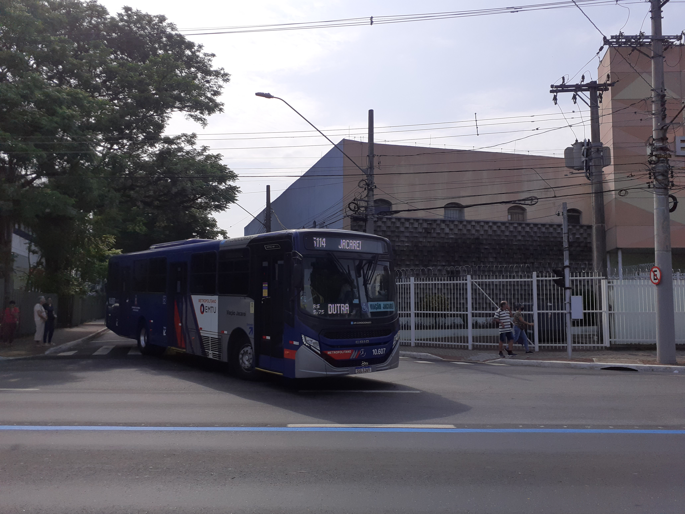

# Apresentação do Projeto
## Dados do PEMOB 2023 Municipal em Mobilidade Urbana
Foi uma pesquisa realizada pelo Governo Federal onde o mesmo catalogou registros em 67 municipios e 13 regiões metropolitanas com os dados correspondentes ao ano de 2022.

O questionário teve ao todo cerca de 415 perguntas que foram apresentadas em uma planilha de excel, podendo ser adaptada ao software de sua preferencia como o Microsoft Excel, Google Planilhas, LibreOffice, WPS Office, Planmaker e entre outros, ambos representados por colunas, sendo que nove colunas corresponde apenas a perguntas basicas e as demais com dados entre numeros e letras, onde neste ultimo corrresponde ao numero 0, no caso do metropolitano possui algumas didáticas diferentes em relação a sua natureza.

As colunas corresponde aos municipios envolvidos na pesquisa daquele ano em 2022, utilizados como exemplo, uma vez que possui dados atuais e mais recentes.

## Apendice
### Termos tecnicos relacionados aos dados apresentados
Aqui voce verá alguns termmos tecnicos utilizados mediante ao que foi abordado no questionario, todas as fotos são de minha autoria, caso alguem queira utilizar, por favor colocar os creditos uma vez que eu tenho exclusividade sobre o mesmo.

Sistema Urbano: Rede de linhas ou sistema interligado que consiste em rotas que abrange um determinado municipio.

Sistema Metropolitano: Denominado de Semiurbano ou Interurbano é aquele serviço que possui caracteristicas próximas a de um sistema urbano, porem interligando uma ou mais cidades, geralmente municipios vizinhos de acordo com a malha urbana.

Ciclovias: Vias especificas para o transitro de bicicletas, não confundir com ciclofaixas que são faixas exclusivas dentro da via junto com outros veiculos reservadas para bicicletas.

Taxi: Serviço onde o passageiro usa um carro para pegar carona e pagar o valor correspondente a distancia pecorrida após o termino da corrida, o mesmo se aplica para aplicativo.

Terminais: Locais onde diversas linhas da cidade ou fora dela chegam no ponto final.

VLP: Veluclo leve sobre Pneus, utiliza a estrutura de um onibus porem leve.

VLT: Veiculo Leve sobre Trilhos, utiliza a mesma estrutura de um trem, porem de forma leve.

Trolebus: Onibus que possui rede aerea e movido a eletrecidade.

Plataforma Elevatória: Degrau que fica instalado dentro dos onibus que pode ser transformado em um elevador quando o mesmo estiver em uso.

Onibus de Piso Baixo: Veiculo que possui sistema de rebaixamento e uma rampa que permite o embaque direto em nivel, em relação a calçada, neste caso possui acessebilidade universal.

Onibus Articulado: Veiculo que possui dosi vagões, podendo ter tres ou quatro eixos e tambem podendo ser de piso baixo ou piso normal.

Onibus Biarticulado: Veiculo que possui tres vagões, podendo ter quatro eixos e poderá ser de piso baixo ou piso normal.

Embarque em Nivel: Onibus que possui portas no nivel da carroceria, geralmente de piso alto, tambem poderá ser denominado de acesso em nivel.

Monotrilho: Trem que possui uma unic estrutura para poder se locomover, geralmente em uma altura elevada em relação ao solo.

Aeromovel: Modelo de trem queu é leve e possui semelhança ao monotrilho ou a um trem elevado.

Barca: Embarcação de passageiros que é utilizado para transporte em vias hidrovias de grande porte.

Mototaxi: Serviço de taxi que utiliza moto, podendo tambem ter versão para aplicativo.

Transporte Escolar: Serviço especifico para transporte de alunos, tanto da rede publica como da rede privada do municipio.

Transporte Alternativo: Serviço especifico onde complementa a rede de transporte publico.

Sistema Radial: É uma rede onde as linhas de todas as regiões vão a um ponto especifico geralmente no centro da cidade e as linhas operam em sistema bairro/centro centro/bairro.

Sistema em Malha: É um sistema onde as linhas são organizadas em uma malha, geralmente com todas as linhas operando de forma diametral e os cruzamentos ocorrem em locais especificos.

Sistema Tronco-Alimentação: É um sistema misto onde possui elementos tanto do sistema radial como do em malha, geralmente com terminais locais para atentar e maximizar a demanda de oferta de uma determinada região.

## Dados do PEMOB 2023 Metropolitana em Mobilidade Urbana

É semelhante ao do municipal, porem com algumas diferenças uma vez que a natureza do mesmo é diferente, principalmente devido as linhas e os serviços que são entre cidades de uma mesma região.

Aqui no Vale do Paraiba as linhas metropolitanas são de responsabilidade da ARTESP com o processo de liquidação da EMTU inciada neste ano de 2025.

### Observação
Repositório reutilizado de atividade extra de engenharia de sofware, feito em 2021, porém sem código dentro do certame.
